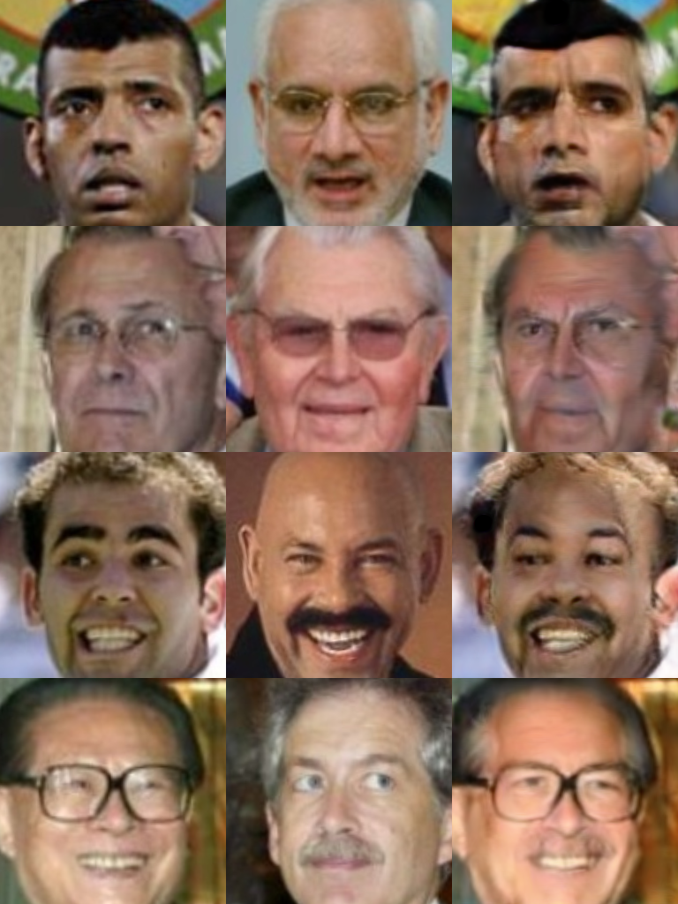
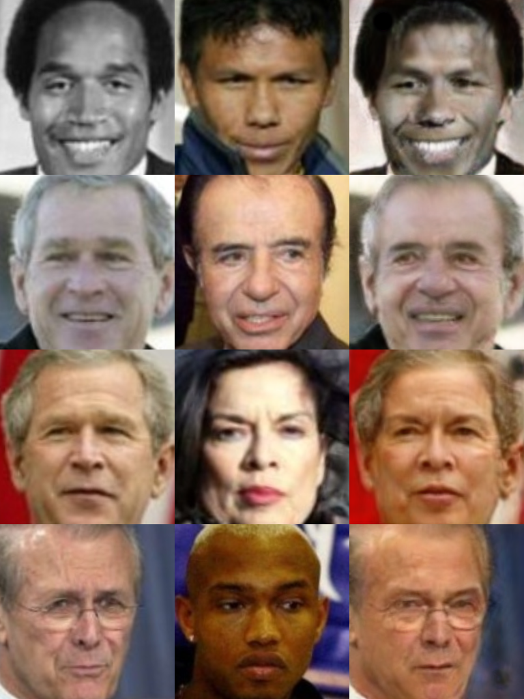
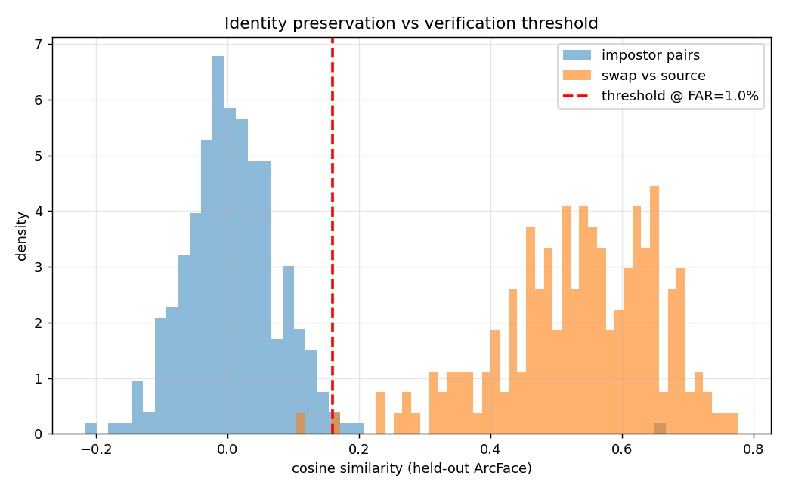
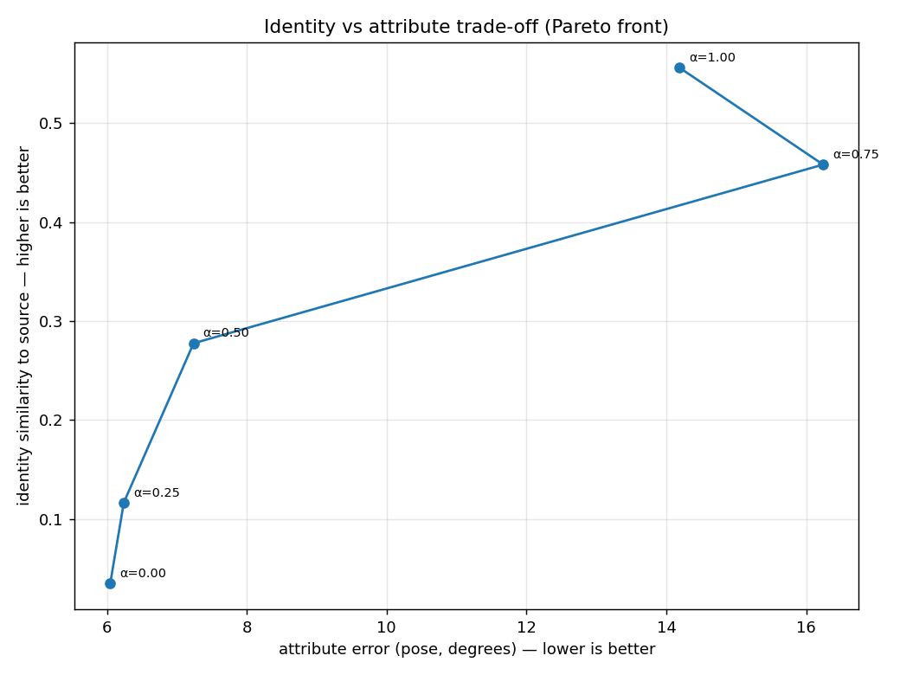

# Face Swap — Project Report

A single-pass, identity-agnostic face-swap system (SimSwap-style GAN) that takes
a source identity and a target photo/video and produces the swap while keeping
the target's pose, expression and lighting. Built end-to-end: data pipeline,
training, evaluation, image + video inference, and an CLI interface.

## Data (read this first)

Trained on **LFW** (~9,430 aligned faces, 4,395 identities, 1,238 with more than
one image after quality filtering). LFW was built for face *verification*, not
swap *training*: most people appear once, at ~250px web quality. That makes it
the right tool to **measure** identity preservation but a weak tool to **train**
generation, and it sets a hard ceiling on output quality. This is the single
most important caveat in the project, and the reason a dataset-update path was
built in: better data is the biggest available improvement.

## Design decisions

- **Architecture:** one generator takes (target image, source identity vector)
  and outputs the swap in a single forward pass — so it swaps any face into any
  face without per-pair retraining, and is fast enough for video.
- **Pretrained models used:**
  - *InsightFace `buffalo_l`* (RetinaFace) — face detection + 5-point landmarks.
  - *ArcFace r50* (frozen) — turns a face into a 512-d identity vector; used both
    to **condition** the generator and to compute the **identity loss**.
  - *ArcFace r100* (held-out) — used **only** to score identity at evaluation, so
    we never grade against the network we trained on.
- **Generator:** encoder → 9 AdaIN residual blocks → decoder, 256px.
  Identity is injected via AdaIN in the bottleneck; the target's content flows
  through the encoder.
- **Discriminator + losses:** multi-scale PatchGAN; identity (cosine),
  reconstruction (L1, same-identity steps only), hinge adversarial, and **weak
  feature matching** (SimSwap's key idea — preserves pose/expression without
  fighting the identity change).
- **256px on purpose:** matched to LFW's real resolved detail, not the GPU limit.

## Training

Adam (betas 0/0.999), mixed precision on CUDA, two-regime pairing (cross-identity
swaps + occasional same-identity reconstruction). Trained on an RTX 3080;
develops/runs on Apple-silicon Mac. Loss curves were stable; identity loss fell
on cross-identity steps once real ArcFace weights were loaded.

> **[Placeholder — training samples]**
> 
> 
* [target | source | swapped] grid at step 50k.*
> 
* [target | source | swapped] grid at step 100k.*

## Evaluation — what we measured and what we got

"Accuracy" isn't one number for a swap; it's a trade-off, so we measured identity,
attributes and blend separately and report a curve.

- **Identity preservation:** scored with the held-out ArcFace r100 at a threshold
  calibrated to a 1% false-accept rate. Result: **99.5% of swaps pass**, mean
  swap-vs-source cosine **0.53** while impostor (different-person) pairs sit near
  **0.0** — a clean separation, i.e. identity genuinely transfers.
- **Identity vs attribute trade-off (Pareto):** sweeping injection strength shows
  an **elbow around 0.5** — below it identity is cheap (pose error ~6°), above it
  identity keeps rising but pose error jumps to 14–16°. So ~0.5 is the efficient
  operating point.

> **[Placeholder — evaluation graphs]**
> 
> 
> *Left: impostor vs swap-vs-source distributions with the FAR threshold. Right:
> identity-vs-pose trade-off curve.*

## Comparison to baselines (what we'd do, and reference numbers)

A rigorous study would benchmark head-to-head against **SimSwap** and
**Inswapper**, the recognised open-source baselines. We didn't run them directly
(time, and Inswapper's non-commercial licence), but the literature gives useful
reference context. Pirogov & Artemev (*Evaluating Deepfake Detectors in the Wild*,
ICML 2025) built a 500k-image benchmark from exactly these two generators and
report that **fewer than half of state-of-the-art detectors exceeded 60% AUC**
against them — i.e. the baselines are highly realistic.

The important contrast is **data, not architecture**: the proposed model mirrors SimSwap's
design (ArcFace + AdaIN + PatchGAN + feature matching), but SimSwap trained on
**VGGFace2** (millions of images) at 224px and **VGGFace2-HQ** at 512px, while we
trained on ~9.4k LFW faces at 256px. That scale/quality gap, not the method, is
the main reason for the quality difference.

## Video

The pipeline (detect → track via optical flow → swap → blend) runs in **real time
(~31 FPS)**. Output quality was modest: it was tested with a **high-resolution
internet video** and a **low-resolution LFW source image**, on a model trained
only on LFW. That's distribution shift on top of the data ceiling — the mechanism
works, but a 256px LFW-trained face pasted into a sharp HD frame looks soft. Not a
pipeline bug; a data/resolution limitation.

## Limitations & future work

Data is the bottleneck. In order of impact: train on a higher-quality,
multi-image dataset (VGGFace2-HQ via the update pipeline); raise output to 512px;
add a face-parsing mask for cleaner blends; and add a post-process enhancer
(GPEN / CodeFormer), which the same paper shows can make low-res swaps visually
indistinguishable from real. Occlusion handling (FaceShifter-style) is the
remaining known gap.

## References
1. Pirogov and Artemev, Evaluating Deepfake Detectors in the Wild (https://arxiv.org/abs/2507.21905)
2. Wang et al., DynamicFace: High-Quality and Consistent Video Face Swapping using Composable 3D Facial Priors (https://arxiv.org/html/2501.08553v1)
3. SimSwap papaer and github repo: https://github.com/neuralchen/simswap
4. Li et al., Towards High Fidelity Face Swapping: A Comprehensive Survey and New Benchmark (https://arxiv.org/pdf/2605.00883)
5. faceswap github repo: https://github.com/deepfakes/faceswap
